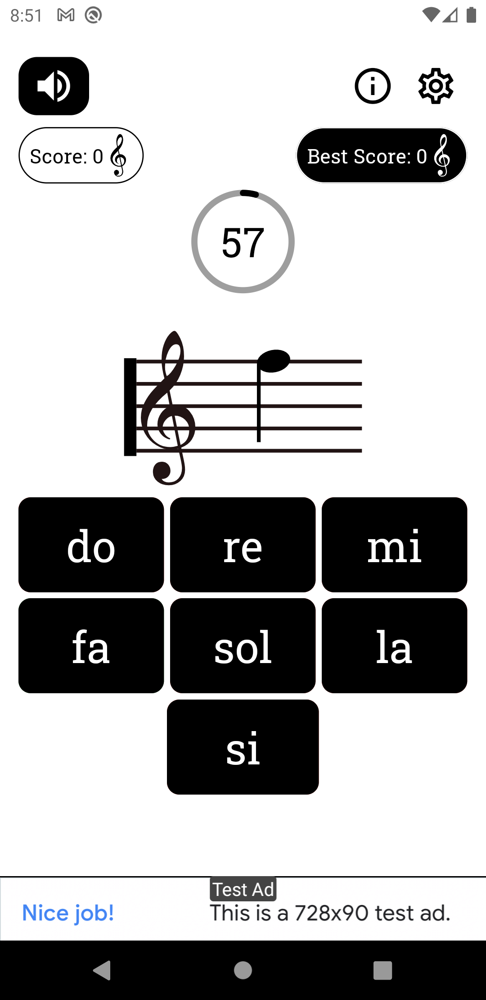
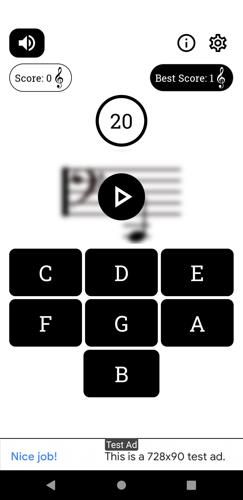
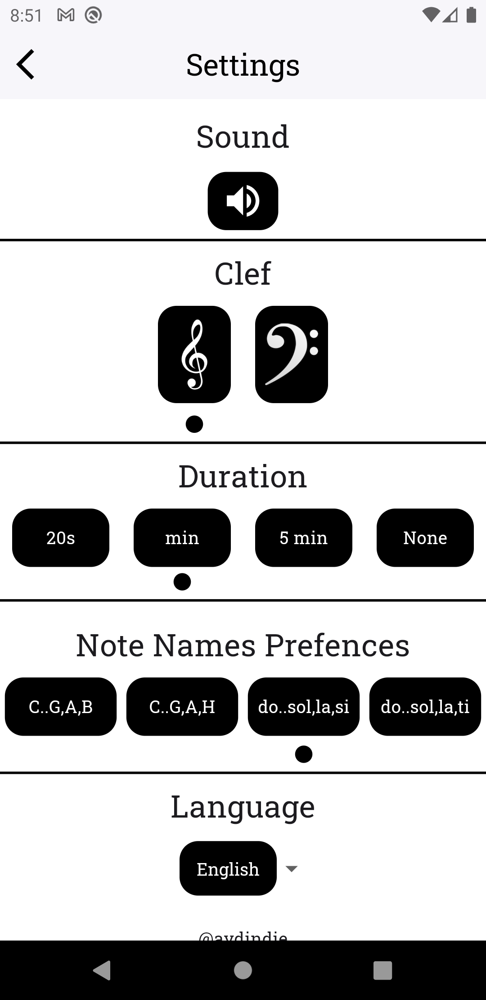

# Learning Music Notes App

Download the app from the Google Play Store:
[](https://play.google.com/store/apps/details?id=com.aydindie.notelearn)


## How to Configure

To configure your project for different environments (development, testing, production), follow these steps:

1. **Create `.env` file**: Create a file named `.env` in the root directory of your project.

2. **Define Environment Variables**: Populate the `.env` file with your environment-specific variables. Here's an example for setting up AdMob IDs:

   ```dotenv
   # Test Environment
   TEST_BANNER=your_test_banner_id
   TEST_INTERSTITIAL=your_test_interstitial_id
   TEST_REWARDED=your_test_rewarded_id

   # Release Environment
   RELEASE_BANNER=your_release_banner_id
   RELEASE_INTERSTITIAL=your_release_interstitial_id
   RELEASE_REWARDED=your_release_rewarded_id

   # iOS Environment
   IOS_BANNER=your_ios_banner_id
   IOS_INTERSTITIAL=your_ios_interstitial_id
   IOS_REWARDED=your_ios_rewarded_id
    ```

Replace your_test_banner_id, your_test_interstitial_id, etc. with your actual AdMob IDs for each environment.

Accessing Environment Variables: In your Dart code, use a package like flutter_dotenv or flutter_config to load these variables dynamically based on your environment.

in app images:






## Potential Future Features

- Ensure random notes do not repeat consecutively.
- Implement BaseView for cleaner UI management.
- **Ad-Free Version**: Implemented in-app purchase option to remove advertisements.
- **Dark Mode**: Enabled dark mode for improved visibility in low-light environments.
- **Vibrate**: Added haptic feedback for enhanced user interaction.
- **Score Decrease**: Implemented feature to decrease user scores.
- **Average Score**: Displayed average scores for better user engagement.
- **Scoreboard**: Added scoreboard to track and display high scores.
## Completed Tasks

- Added support for multiple languages in both `main.dart` and `supported_langs.dart` ✅
- Defined colors as constants to maintain consistent theming ✅
- Updated package name for clarity and consistency ✅
- Implemented sound feedback when notes are tapped ✅
- Enabled ability to replay the same note ✅
- Initialized default values on app launch, with changes saved to storage ✅

